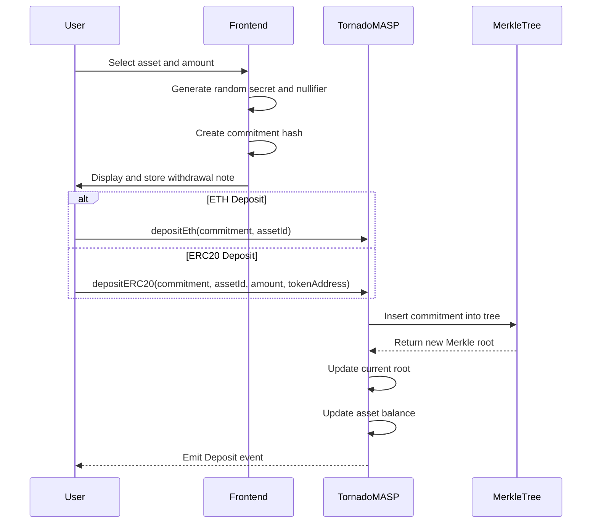
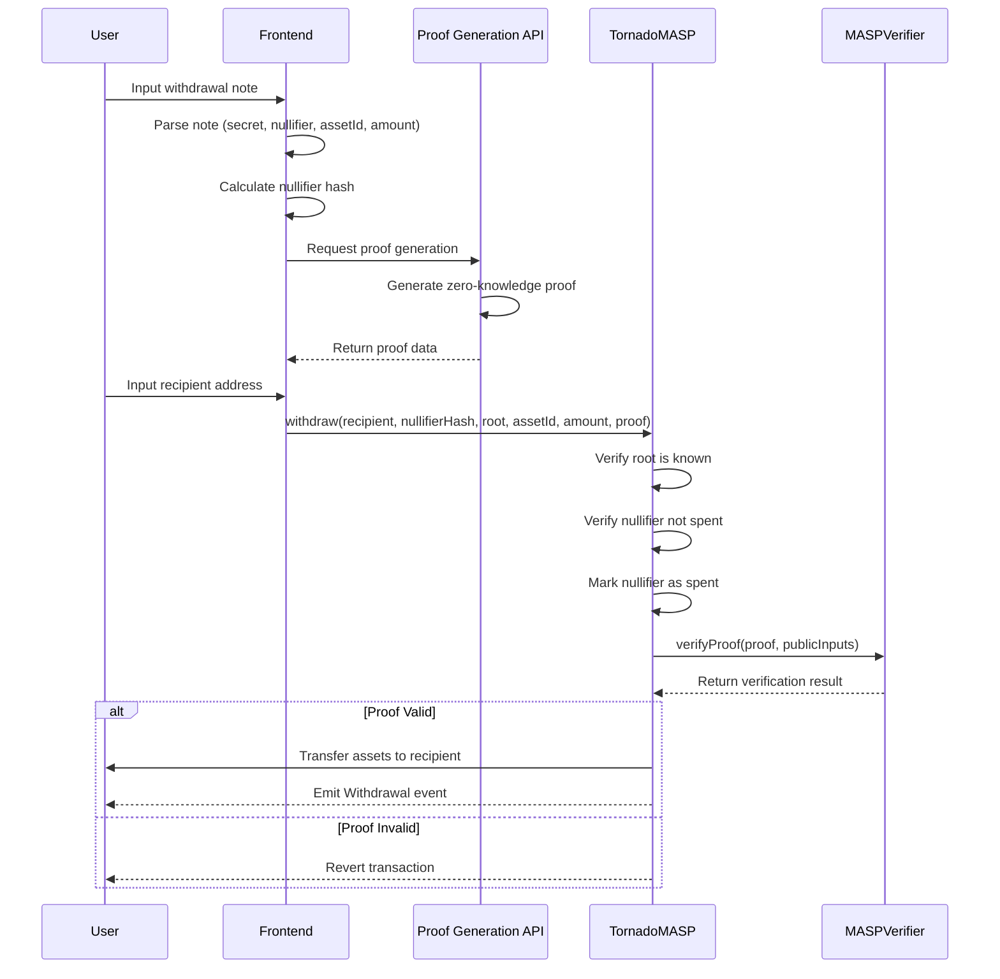

# Tornado MASP User Flow

This document describes the user flow for depositing and withdrawing assets using the Tornado Multi-Asset Shielded Pool (MASP) with zero-knowledge proof verification.

## Overview

The Tornado MASP system allows users to deposit ETH and ERC20 tokens into a shielded pool and later withdraw them to a different address, breaking the on-chain link between the deposit and withdrawal addresses. This privacy is achieved through zero-knowledge proofs, which allow users to prove they have the right to withdraw funds without revealing which deposit they are claiming.

## System Components

1. **Smart Contracts**:
   - `TornadoMASP.sol`: The main contract that handles deposits and withdrawals
   - `MASPVerifier.sol`: Verifies zero-knowledge proofs during withdrawals

2. **Frontend**:
   - Web interface for interacting with the contracts
   - Handles note generation and management

3. **Proof Generation**:
   - API endpoint for generating zero-knowledge proofs
   - Uses the user's secret information to create proofs

## Deposit Flow



### Deposit Process Details

1. **Preparation**:
   - User selects an asset (ETH or an ERC20 token) and an amount to deposit
   - Frontend generates a random secret and nullifier
   - Frontend creates a commitment hash from the secret, nullifier, and asset information

2. **Note Creation**:
   - Frontend creates a withdrawal note containing the secret, nullifier, asset ID, and amount
   - User saves this note securely (it will be needed for withdrawal)

3. **On-chain Deposit**:
   - For ETH: User calls `depositEth` with the commitment and asset ID
   - For ERC20: User calls `depositERC20` with the commitment, asset ID, amount, and token address
   - Contract transfers the assets from the user to itself
   - Contract inserts the commitment into the Merkle tree
   - Contract updates the current Merkle root and asset balance
   - Contract emits a Deposit event

## Withdrawal Flow



### Withdrawal Process Details

1. **Preparation**:
   - User inputs their withdrawal note into the frontend
   - Frontend parses the note to extract the secret, nullifier, asset ID, and amount
   - Frontend calculates the nullifier hash

2. **Proof Generation**:
   - Frontend calls the proof generation API with the necessary parameters
   - API generates a zero-knowledge proof that proves the user knows the secret corresponding to a commitment in the Merkle tree
   - API returns the proof data to the frontend

3. **On-chain Withdrawal**:
   - User specifies a recipient address (can be different from the deposit address)
   - Frontend calls the `withdraw` function with:
     - Recipient address
     - Nullifier hash
     - Merkle root
     - Asset ID
     - Amount
     - Zero-knowledge proof
   - Contract verifies the Merkle root is known
   - Contract verifies the nullifier has not been spent
   - Contract marks the nullifier as spent

4. **Proof Verification**:
   - TornadoMASP contract calls the MASPVerifier contract to verify the proof
   - MASPVerifier checks that the proof is valid for the given public inputs

5. **Asset Transfer**:
   - If the proof is valid, the contract transfers the assets to the recipient
   - Contract emits a Withdrawal event
   - If the proof is invalid, the transaction is reverted

## Technical Details

### Commitment Generation

The commitment is a hash of the user's secret, nullifier, and asset information:
```
commitment = hash(secret || nullifier || assetId)
```

### Nullifier Hash

The nullifier hash is used to prevent double-spending:
```
nullifierHash = hash(nullifier || assetId)
```

### Zero-Knowledge Proof

The zero-knowledge proof proves the following statements without revealing the secret or nullifier:
1. The user knows a secret and nullifier that hash to a commitment
2. The commitment is in the Merkle tree (i.e., a valid deposit)
3. The nullifier hash is correctly derived from the nullifier and asset ID
4. The asset ID and amount match the deposit

### Public Inputs to the Verifier

The public inputs to the verifier include:
1. Merkle root
2. Nullifier hash
3. Recipient address
4. Asset ID
5. Amount

## Security Considerations

1. **Note Security**: The withdrawal note must be kept secure. If lost, the funds cannot be recovered. If stolen, the thief can withdraw the funds.

2. **Timing Attacks**: To maximize privacy, users should wait some time between deposit and withdrawal, and withdraw to a different address than the deposit address.

3. **Metadata Leakage**: Be careful about metadata that could link deposit and withdrawal (e.g., transaction timing, amounts, IP addresses).

4. **Proof Generation**: The proof generation happens client-side or via a trusted API to ensure the secret and nullifier are not exposed to third parties.
